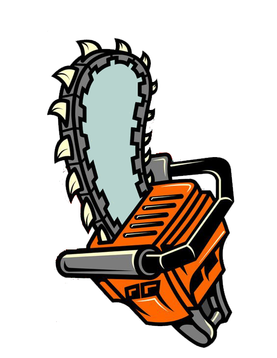

# chainsawm

<div style="text-align: center;">
    
</div>

## Window manager that aims to keep its code and functionality sharp.

I often find myself using only very little of the features provides by other window managers. Oftentimes they don't work the way I want them to. Thus, chainsawm was born.

Chainsawm aims to stay sharp - that is, no ultra minimal fanboyism. A short description of what chainsawm aims to be : It Just Works™

How different is this from ```dwm``` and others? Frankly, I am not sure. Part of the motive for this project was usability, and the other was curiosity.

## Suckless configuration
In true suckless fashion, this window manager is configured entirely using ```config.h```, and further modifications are made directly to the source. The project has been written while keeping scalability in mind, so that adding new features is easy.

## Status
    [x] Layout: Tiling master-stack
    [x] EWMH: Bare minimum
    [x] Startup script: Any executable
    [x] Hotkeys: Hack the source code
    [x] Workspaces: Fixed 8 with no support for external control
The project is in what I would consider a beta stage, as a lot of features are implemented - but everything has not been wrapped into a shiny new casing.

For default keybinds, look in ```config.h```

## Installation
I don't plan on providing package-manager/OS specific scripts. Instead, just ```make install```. Create the startup script at ```~/.config/chainsawm/startup``` and give it executable permissions.

# License - MIT
```
Copyright 2023 Guruprasad AH <guruprasadah08@gmail.com>

Permission is hereby granted, free of charge, to any person obtaining a copy of this software and associated documentation files (the “Software”), to deal in the Software without restriction, including without limitation the rights to use, copy, modify, merge, publish, distribute, sublicense, and/or sell copies of the Software, and to permit persons to whom the Software is furnished to do so, subject to the following conditions:

The above copyright notice and this permission notice shall be included in all copies or substantial portions of the Software.

THE SOFTWARE IS PROVIDED “AS IS”, WITHOUT WARRANTY OF ANY KIND, EXPRESS OR IMPLIED, INCLUDING BUT NOT LIMITED TO THE WARRANTIES OF MERCHANTABILITY, FITNESS FOR A PARTICULAR PURPOSE AND NONINFRINGEMENT. IN NO EVENT SHALL THE AUTHORS OR COPYRIGHT HOLDERS BE LIABLE FOR ANY CLAIM, DAMAGES OR OTHER LIABILITY, WHETHER IN AN ACTION OF CONTRACT, TORT OR OTHERWISE, ARISING FROM, OUT OF OR IN CONNECTION WITH THE SOFTWARE OR THE USE OR OTHER DEALINGS IN THE SOFTWARE.